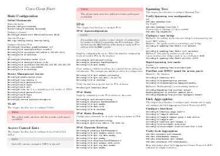
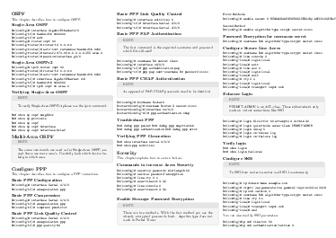

# Cisco cheat sheet

This is a Cisco reference sheet which is geared toward practical usage. Feel free to create a pull request for suggestions. This cheat sheet is based on the [LaTeX cheat sheet](http://wch.github.io/latexsheet/) by [Winston Chang](https://github.com/wch).

PNG images of the reference sheet:

## Download

[PDF](https://github.com/roaldnefs/cisco-cheatsheet/blob/master/cheatsheet.pdf) (A4) | [LaTeX](https://github.com/roaldnefs/cisco-cheatsheet/blob/master/cheatsheet.tex)

## License

This work is licensed under a [Creative Commons Attribution 3.0 Unported License](ttp://creativecommons.org/licenses/by/3.0/).
